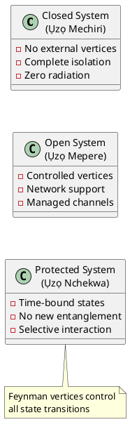

# QFT-ISO: Quantum Field Theory for Dynamic ISO Systems

## When Quantum Systems Fail, I Built My OWN - And you should too

### Project Vision

This project implements a revolutionary approach to system isolation using Quantum Field Theory (QFT) principles and Feynman diagram modeling for secure, dynamic ISO management.

### Core Architecture

The QFT-ISO framework operates on three fundamental system states:

#### 1. **Ụzọ Mechiri Emechi** (Closed System)
- **Architecture**: Fully arched/sealed system
- **Properties**:
  - Closed to pollution and explicit emission
  - Zero radiation leakage
  - No external interference
  - Complete quantum isolation

#### 2. **Ụzọ Mepere Emepe** (Open System)  
- **Architecture**: Interactive support system
- **Properties**:
  - Open to network support
  - Controlled interaction vertices
  - Managed quantum channels
  - Bidirectional communication

#### 3. **Ụzọ Nchekwa** (Protected/Time-Bound System)
- **Architecture**: Dynamic state management
- **Properties**:
  - Closed to new entanglement
  - Time-bound state transitions
  - Selective interaction protocols

### Theoretical Foundation

Using Feynman diagram formalism, we model system interactions where:
- **Particles** = System components/data
- **Vertices** = Interaction points
- **Propagators** = Communication channels
- **Decoherence** = Security breaches

### Key Features

- **No Direct Attack Vectors**: Attacks can only cause decoherence, never direct compromise
- **Physics-Based Security**: Using quantum mechanics laws as security principles
- **Dynamic ISO Loading**: Real-time system state management without FFI
- **Zero Trust Architecture**: All interactions verified through quantum protocols

### System Diagram



### Technical Implementation

The system uses quantum decoherence as the primary security model:

```python
class QuantumISOSystem:
    def __init__(self):
        self.state = "CLOSED"  # Ụzọ Mechiri
        self.coherence = 1.0   # Full coherence = secure
        
    def calculate_decoherence(self, attack_vector):
        """Attacks cause decoherence, not direct breach"""
        return attack_vector.coupling * self.noise_amplitude
```

### Origin Story

Born from the challenges faced in Biafra and across African nations, this project represents a new approach to system security. When conventional quantum systems failed to provide adequate isolation, we built our own - using the fundamental laws of physics as our defense.

### Installation

```bash
# Clone the repository
git clone https://github.com/obinexus/qft-iso.git

# Navigate to project
cd qft-iso

# Install dependencies
pip install -r requirements.txt
```

### Usage

```python
from qft_iso import QuantumISO

# Initialize closed system
iso = QuantumISO(state="closed")

# System remains secure through physics
# No direct attack possible - only decoherence
```

### Documentation

- [Vision Document](docs/vision/quantum-iso-vision.md) - Comprehensive theoretical framework
- [PlantUML Diagrams](docs/diagrams/) - System architecture visualizations
- [Feynman Models](docs/feynman/) - Quantum interaction diagrams
- [API Reference](docs/api/) - Technical implementation details

### Contributing

This project welcomes contributions that maintain the core principle: security through physics, not just code.

### License

MIT License - Because knowledge should be free

### Acknowledgments

To the resilient people of Biafra and all African innovators building their own solutions when existing systems fail.

---

**"Mgbe usoro quantum daa, m wuru nke m - ị kwesịrị ime otu ahụ"**  
*When quantum systems fail, I built my own - and you should too*
